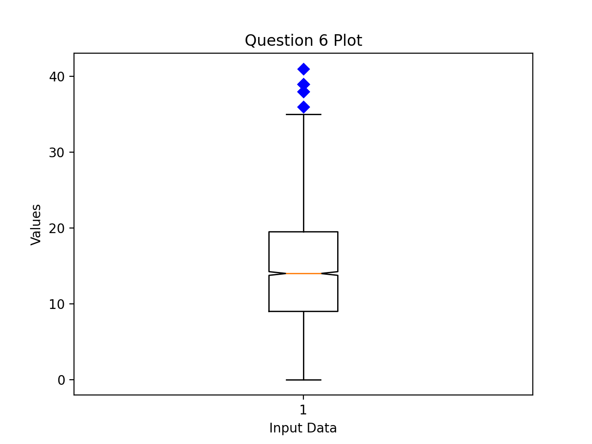

# DSDE1-Computing1 Assessment 2 Instructions

This is an open book/computer/internet assessment. You are allowed to refer to your own notes, previous code, and search online. You are NOT allowed to receive or ask for assistance from any individual such as a fellow classmate or anyone else during the assessment. You may NOT share your code with anyone else until all students have completed the assessment and submission has closed.

If the code you write will be marked using a test file, that test file has been provided so that you can test your code yourself. Note that all code will be also evaluated with PyLint, so you are encouraged to use PyLint to evaluate your own code before the final submission.

## How to Complete the Assessment

1. Clone this repository on your own computer.

2. Commit your answers and push them to your repo on Github. You can (and are encouraged) to do this continuously as you work on the questions.

3. Ensure that you are correctly pushing your changes to the repo by checking on Github for your additions.

4. Your final answers must be pushed by the deadline at 4pm (2 hours after the timed start) unless you have been explicitly been allowed extended time as a reasonable adjustment as recommended by the Disability Advisory Services (students for which this applies have been contacted). Any pushed commits after this time will not be considered for marks and may have the Git penalty described below applied, if git has not been used correctly (e.g. the Github upload button is used instead).

## Assessment Questions
### Using Git

1. Clone this repository on your computer (do not clone it within an existing repository such as the weekly exercises or the practice assessment). Edit the file `question1.txt` located in folder `question1` to include your name, CID, and account names.    *[0 point]*

__NOTE__: If you do not use git to push your code to the correct repository within the allotted assessment time, you will have a penalty of 10% applied to your overall score.

### Reading and Understanding Code

2. Open and try to run the file `question2.py` in the folder `question2`. Fix the problems in the code using the docstring and comments as guidance so that it runs without throwing any errors and passes the test file `test_question2.py`. *[5 points]*

3. Open and try to run the file `question3.py` in the folder `question3`. Fix the problems in the code using the docstring and comments as guidance so that it runs without throwing any errors and passes the test file `test_question3.py`. *[10 points]*

4. Draw the UML class diagram for the `Pizza` class in Question 3. Use the contents of the text file `question4.txt` in the `question4` folder as a template. Carefully read the additional instructions at the top of the file.  *[5 points]*

### Opening Files and Generating Scientific Plots
 
5. Write a Python script that generates the below image, with the following listed characteristics. Write your script in the file `question5.py` in the folder `question5`. *[10 points]*

* Read the jpg file `walkie-talkie.jpg` within the `img` folder in the `question5` folder into a numpy array. In order to achieve full marks, ensure your code will run on another computer (even another operating system) without needing to be edited.

* Write a Python script that will generate a new image based on `walkie-talkie.jpg` with columns 450 to 700 for all rows displaying only the blue channel and all other colums left unchanged.

6. Write a Python script that reads in the csv file `data.csv` and generates a boxplot as shown in the below image, which can also be viewed in the `./question6/img` folder. Write your script in the file `question6.py` in the folder `question6`. *[10 points]*

* Read the CSV file `data.csv` into a numpy array (hint: the delimiter in the file is `','`). In order to achieve full marks, ensure your code will run on another computer (even another operating system) without needing to be edited.

* Create a boxplot, see [https://matplotlib.org/3.1.1/api/_as_gen/matplotlib.pyplot.boxplot.html](https://matplotlib.org/3.1.1/api/_as_gen/matplotlib.pyplot.boxplot.html) for guidance.

* Use the data in the 5th column of the csv file.

* Set the notch to be `True`.

* Change the symbols of the outliers to be blue diamonds, `'bD'`.

* Set the plot title and labels to match the image below (Question 6 Plot, Input Data, Values).

### Writing Python Classes

7. Create a new class and a second class that extends the first following the instructions in the comments in the file
 `question7.py` in the folder `question7` *[30 points]*

8. Create a class with the attributes and methods outlined in the comments in the file `question8.py` in the folder `question8`. *[30 points]*

## Marking Rubric

Detailed marking rubrics can be seen directly in the Python or text files for each question. Note the above mentioned penalty of 10% for not pushing to the correct repository within the time limit.
